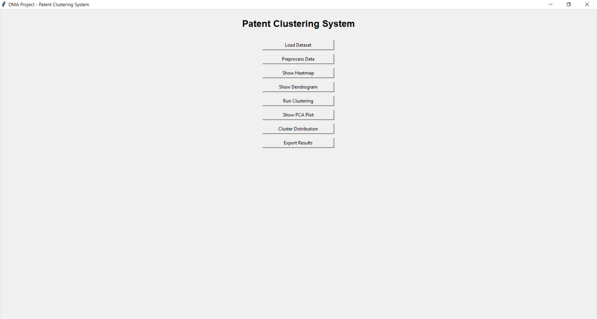
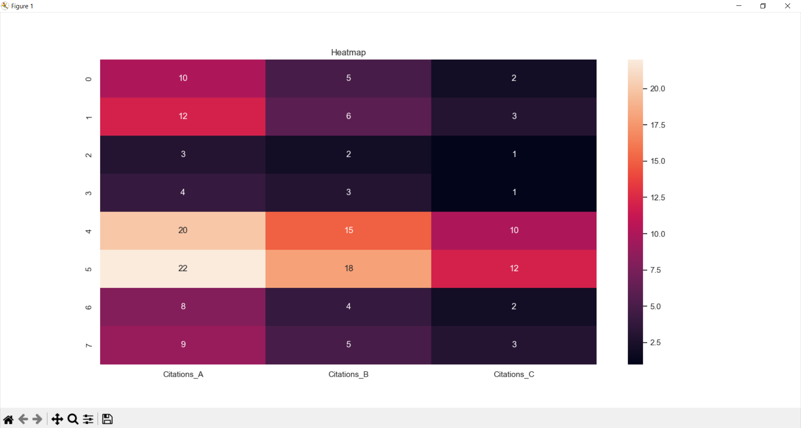
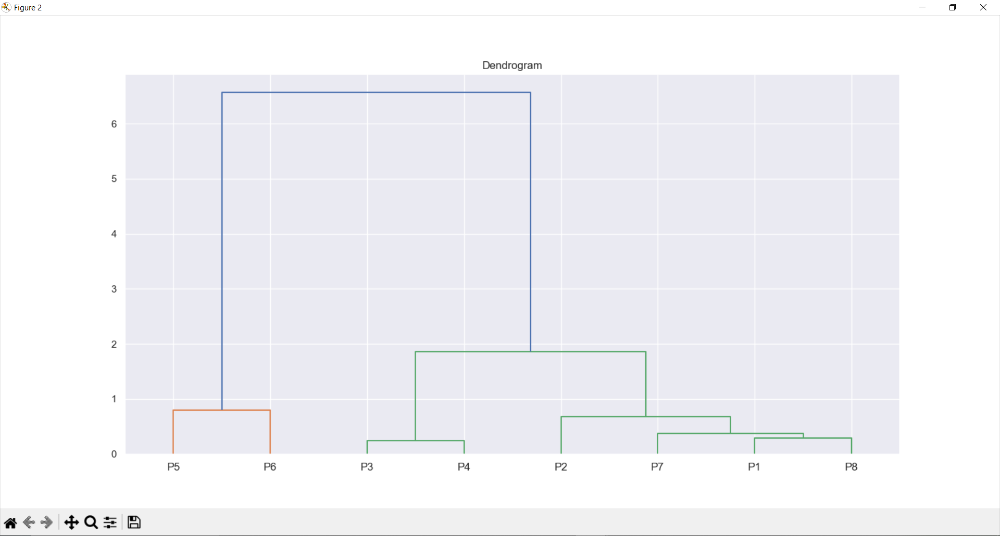
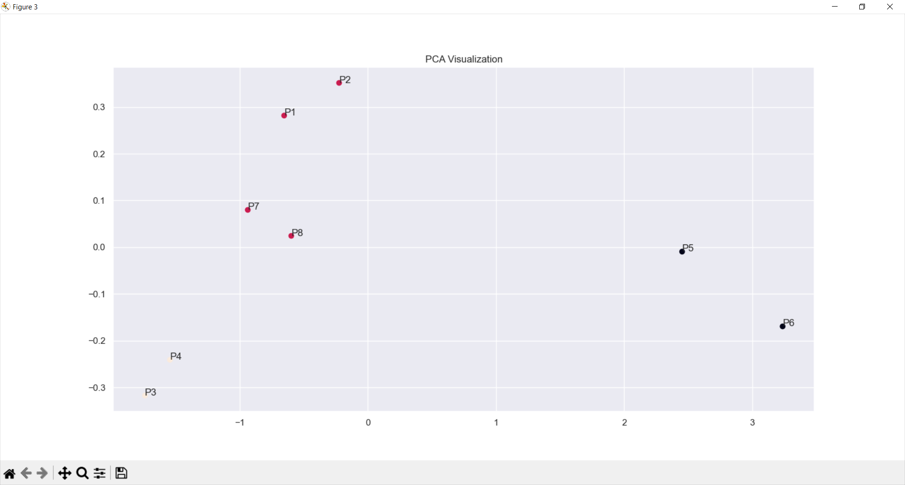

# Patent Clustering System

A Data Mining and Machine Learning application that performs patent clustering using Agglomerative Hierarchical Clustering and provides interactive visualizations for cluster analysis.

## Features

* CSV Dataset Loading
* Data Standardization
* Correlation Heatmap
* Hierarchical Clustering
* Dendrogram Visualization
* PCA-Based Cluster Visualization
* Silhouette Score Evaluation
* Cluster Distribution Analysis
* Export Clustered Results

## Technologies Used

* Python
* Tkinter
* Pandas
* NumPy
* Scikit-Learn
* Matplotlib
* Seaborn
* SciPy

## Machine Learning Workflow

1. Load Patent Dataset
2. Data Preprocessing and Standardization
3. Generate Correlation Heatmap
4. Build Hierarchical Clustering Model
5. Visualize Dendrogram
6. Evaluate Clusters using Silhouette Score
7. Reduce Dimensions using PCA
8. Export Clustered Results

## Screenshots

### Main Dashboard

### Heatmap Analysis

### Dendrogram

### PCA Visualization

### Cluster Distribution

## Installation

pip install pandas numpy matplotlib seaborn scipy scikit-learn

python main.py

## Project Structure

patent-clustering-system/
│
├── main.py
├── dataset.csv
├── screenshots/
├── README.md
└── requirements.txt

## Future Improvements

* Dynamic Cluster Selection
* Additional Clustering Algorithms
* Automated Cluster Recommendations
* Interactive Dashboard Analytics
* Report Generation

## Author

Developed as a Data Mining and Machine Learning project using Python and Scikit-Learn.
